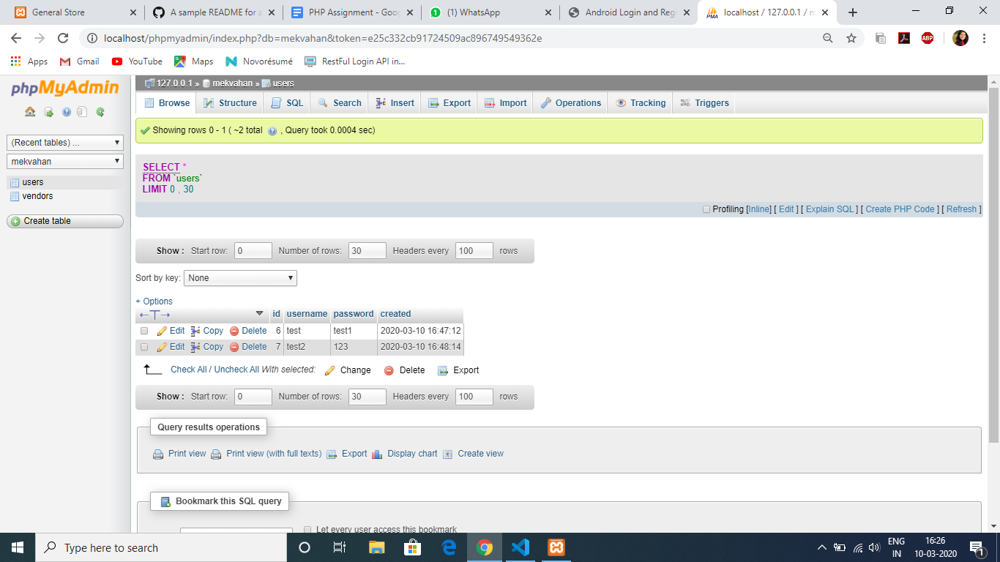
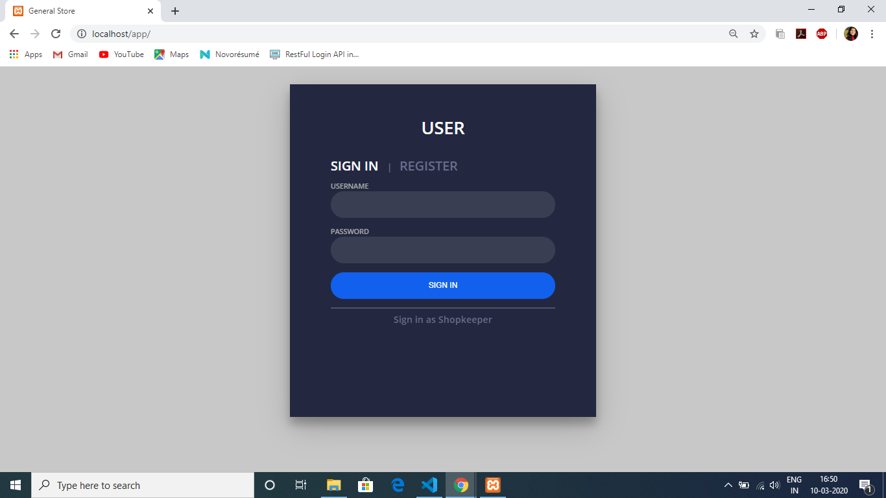

# General Store App
The index.html file is the main registration/login page for the user. From there, one can switch to the registration/login page of Shopkeeper as well. 
Authentication and Registration API for customer as well as shopkeeper are created using basic PHP.

##  API CREATION

1. ### CREATING DATABASE
 Create a database named *Mekvahan* in localhost/phpmyadmin.
Inside that, two tables are to be created namely *users* and *vendors*.

</img>

2. ### DATABASE CONNECTIVITY
Create a folder named "config" inside which a database.php file is to be created to simply connect to the database using PHP's OOPS concept.

3. ### CREATING USER CLASS WITH SIGNUP & LOGIN METHODS
 Create a new folder "objects" and create 2 new files there as "user.php" and "vendor.php" to create User and Vendor classes in these files respectively. Here, signup and login functions are created.
 
 4. ### CREATING SIGNUP & LOGIN WEBSERVICES

 Create a new folder "User" and create a new file there as "signup.php". Similarly, Create a new folder "Vendor" and create a new file there as "signup.php". This file is created for calling the signup function from the "users.php" and "vendors.php" respectively in the objects folder.

 Following the same, create another file in the User and Vendor folder respectively, name the files as "login.php" and call the login function form the "users.php" and "vendors.php" respectively in the objects folder.

## CONNECTING TO FRONT-END

1. ### FOR USER
 index.html file is created containing an HTML form for sign in/registration. To beautify it, a css file is also linked which is kept in assets/css/style.css. Form action is linked to ./user/login.php
 </img>

2. ### FOR SHOPKEEPER
 VendorIndex.html file is created in the same way. 

 </img>

